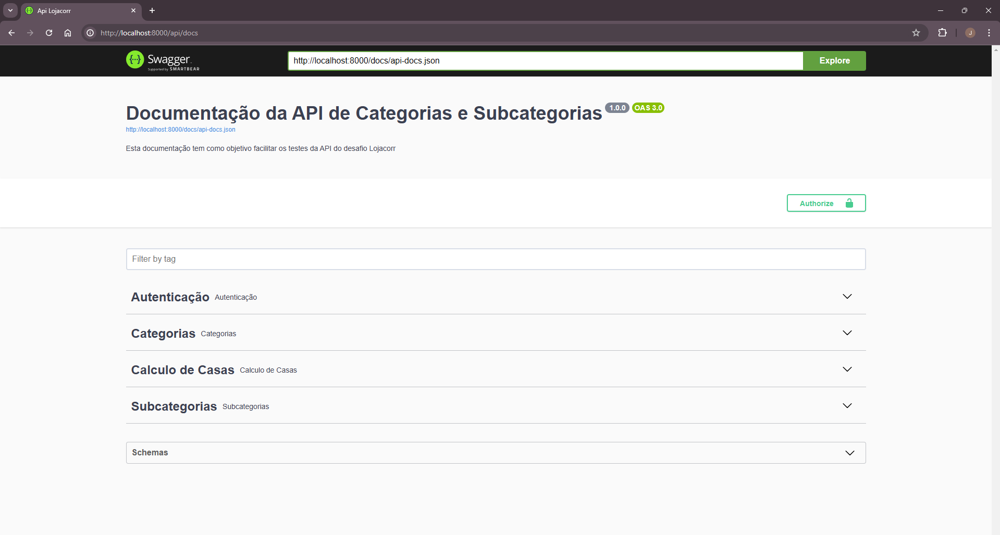
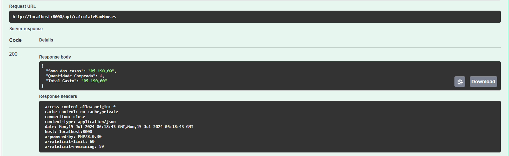
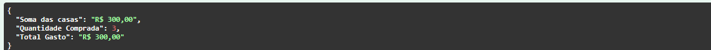
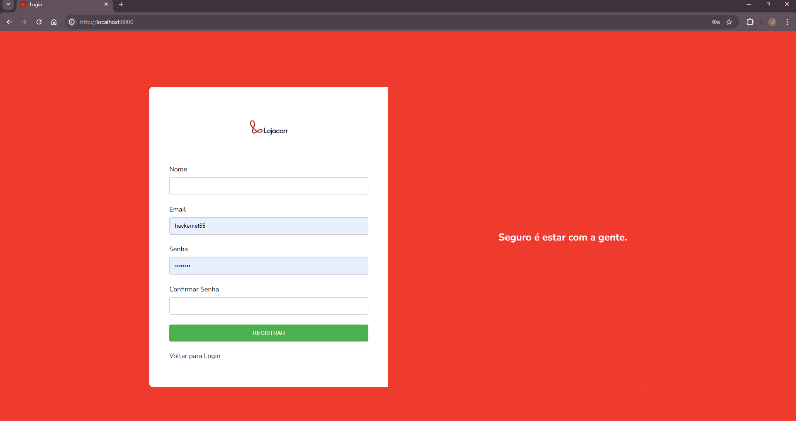
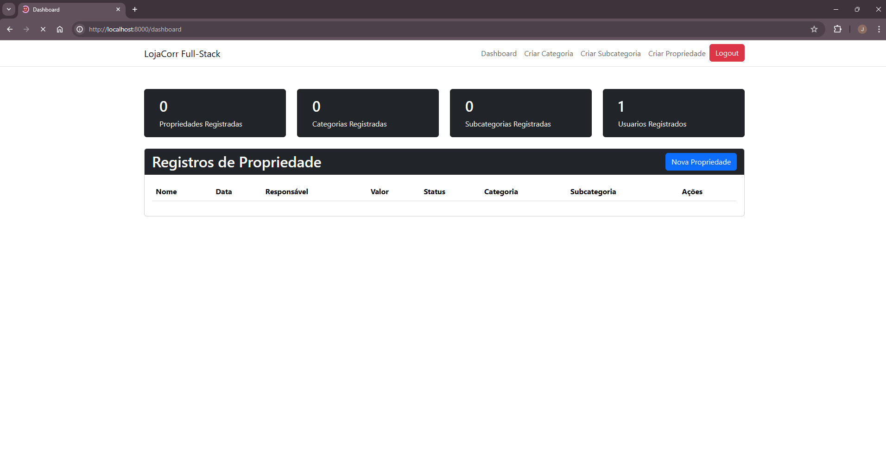
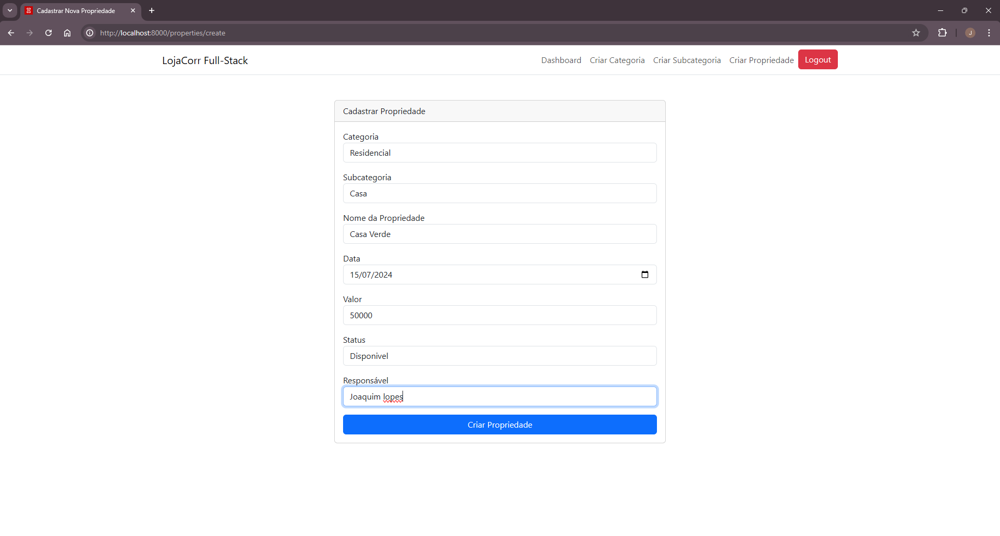
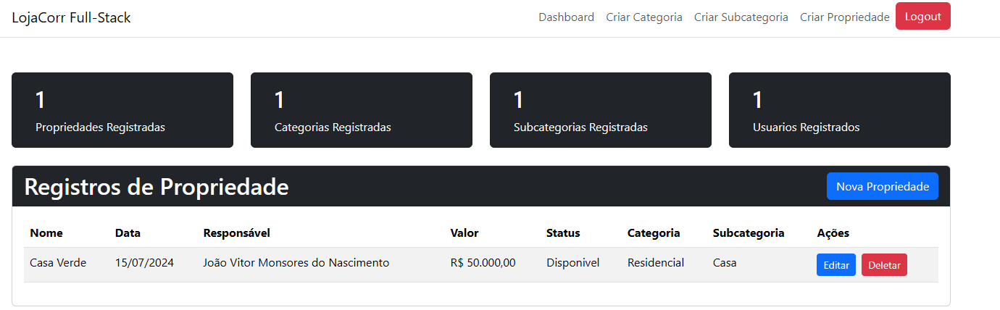
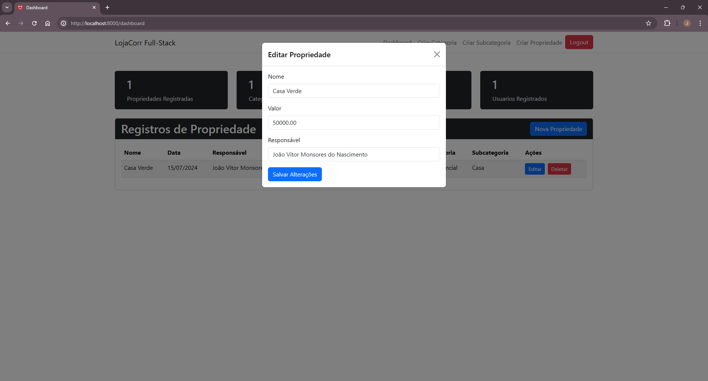
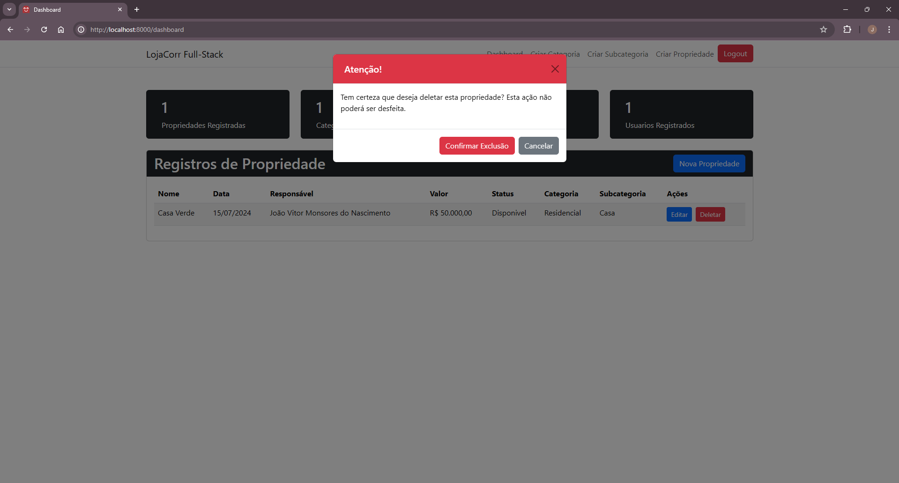

# Projeto LojaCorr

Este é um projeto Laravel para a aplicação LojaCorr.

## Pré-requisitos

Antes de começar, verifique se você possui os seguintes requisitos instalados em sua máquina:

- **Docker**: [Instalação do Docker](https://docs.docker.com/get-docker/)
- **Docker Compose**: [Instalação do Docker Compose](https://docs.docker.com/compose/install/)

## Configuração do Ambiente

1. **Clone o repositório:**

   ```bash
   git clone https://github.com/joaovitormp1998/lojacorr
   cd lojacorr
   ```

2. **Copie o arquivo de exemplo de ambiente:**

    ```bash
    cp .env.example .env
    ```

## Executando o projeto

 ```bash
    docker-compose up -d --build

 ```

- O projeto estará disponivel no endereço:

 ```bash
   http://localhost:8000

 ```

- A api para efetuar teste está disponivel em:

 ```bash
   http://localhost:8000/api/docs

 ```

## Exemplos de Interface

- **Documentação da API:**
  

- **Registro de usuário:**

  ```json
  {
    "name": "João Silva",
    "email": "joao@email.com",
    "password": "senha123"
  }
    ```

- **Login:**

  ```json
  {
    "email": "joao@email.com",
    "password": "senha123"
  }
    ```

- **Calculo Maximo de Casas:**


    Caso o orçamento não atenda

  ```json
  {
  "budget": 300,
  "housePrices": [
    10,20,60,100
  ] }
```

    Caso o orçamento  atenda

  ```json
  {
  "budget": 300,
  "housePrices": [
    100,100,100
  ] }
```
Extras







